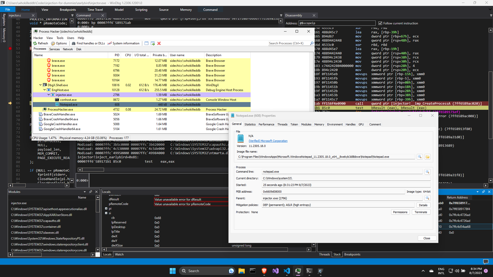
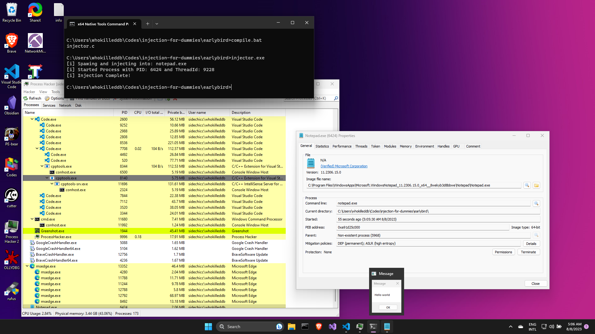
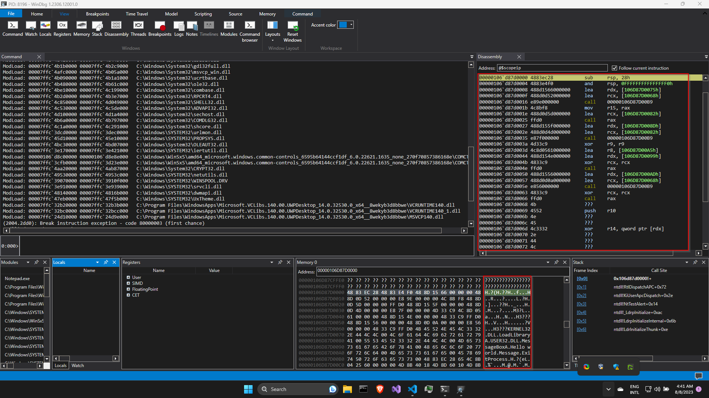
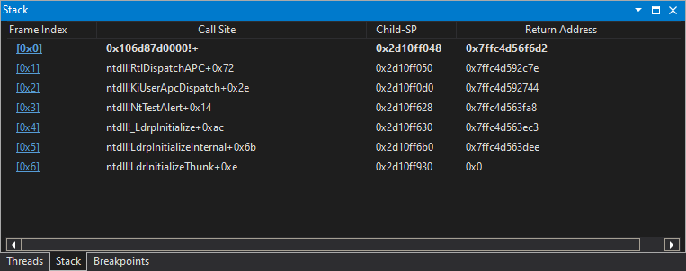

# Earlybird Injection
Earlybird injection is an improvement over the **APC Injection** Technique. The most important drawback of the **APC Injection** technique was that the program entered into a _Wait-and-Pray_ state, where we could only hope that our payload would get executed. That is not very reliable as there is a fair chance that the payload might not even be executed. 

This is where **Earlybird Injection** comes in handy by making sure that our payload is triggered every time. To understand how the technique works, let's jump directly into the code. 

## The Code
Lets begin with the `main()` function:

```c
printf("[i] Spawing and injecting into:\t%s\n", TARGET);
int result = inject_earlybird();
printf("[i] Injection Complete!\n");
return 0;
```

The first difference we notice is that we do not have a `find_pid()` function like other examples. This is because we _launch_ the target process instead of injecting into an already running process. So, let's look into the `inject_earlybird()` function:

```c
int inject_earlybird() {
    DWORD bWritten = 0;
    
    STARTUPINFO si;
    PROCESS_INFORMATION pi;

    ZeroMemory( &si, sizeof(si) );
    ZeroMemory( &pi, sizeof(pi) );
    si.cb = sizeof(si);

    CreateProcessA(0, TARGET, 0, 0, 0, CREATE_SUSPENDED, 0, 0, &si, &pi);
    printf("[i] Started Process with PID: %d and ThreadId: %d\n", pi.dwProcessId, pi.dwThreadId);

    void * pRemoteCode = VirtualAllocEx(pi.hProcess, NULL, payload_len, MEM_COMMIT, PAGE_EXECUTE_READ);
    WriteProcessMemory(pi.hProcess, pRemoteCode, (PVOID) payload, (SIZE_T) payload_len, (SIZE_T *)&bWritten);
    QueueUserAPC((PAPCFUNC)pRemoteCode, pi.hThread, NULL);
    ResumeThread(pi.hThread);
    return 0;
}
```

The function starts by initializing variables and zero-ing out structures. Then, the size of the `STARTUPINFO` structure is stored in the `cb` field of the `si` variable as per [the docs](https://learn.microsoft.com/en-us/windows/win32/api/processthreadsapi/ns-processthreadsapi-startupinfoa). 

Next, we create a process in `SUSPENDED` state using the `CreateProcessA()` function with the following parameters:
 - `lpApplicationName`: In this case, it is set to 0, indicating that the name of the executable ("notepad.exe") is specified in the second parameter.

- `lpCommandLine`: This is a pointer to a null-terminated string that specifies the command line to be executed. In this case, it is set to our `TARGET` process aka `notepad.exe`.

- `lpProcessAttributes`: In this case, it is set to 0, which means the new process handle cannot be inherited

- `lpThreadAttributes`: Similar to the previous parameter, it is set to 0, meaning the returned handle to the new thread object cannot be inherited by child processes.

- `bInheritHandles`: Since this parameter is set to `FALSE`, the inheritable handles in the calling process are NOT inherited by the new process.

- `dwCreationFlags`: This parameter specifies additional options for process creation. In this case, `CREATE_SUSPENDED` flag is used, which means the new process will be created in a suspended state, i.e., it won't start executing immediately.

- `lpEnvironment`: This is set to 0, meaning the new process will inherit the environment variables of the calling process.

- `lpCurrentDirectory`: This is set to 0, indicating that the new process will start in the same directory as the calling process.

- `lpStartupInfo`: A pointer to the `STARTUPINFO` structure.

- `lpProcessInformation`: A pointer to the `PROCESS_INFORMATION` structure that will receive identification information about the new process.

This should create the target process in `SUSPENDED` state. Putting a breakpoint after the `CreateProcessA()` function we can verify that our process has been created:




Next up is the familiar process of allocating memory in the target process(`notepad.exe`) using `VirtualAllocEx()` and copy our payload to the allocated memory using `WriteProcessMemory()`. 

Then, just like in the case of **APC Injection** technique, we use `QueueUserApc()` to add an APC object to the main thread of the suspended target process. With the object now queued, we resume the primary thread with `ResumeThread()` function which should lead to the execution of the payload. 

Compiling and running our code, we should see that we have our payload running in the context of the target program without having to enter a _"Wait-and-Pray"_ state:



But the question is, why? We did not set the thread into an alertable state. The how did the payload get executed? To understand that, we set a breakpoint at our payload address in the target process and run our code. 



Notice the call stack:



The interesting function to notice here is the `NtTestAlert()` function which in turn calls `KiUserApcDispatch()` which calls `RtlDispatchAPC()` which finally calls our payload. 

Putting `NtTestAlert()` function under the debugger we get the following:


It essentially issues a syscall which is used to empty APC queue for the current thread. If there are any lined up APC objects in the queue, it calls `KiUserApcDispatch()`. The `KiUserApcDispatch()` function is responsible for dispatching user-mode APCs to the appropriate user-mode thread. When a user-mode APC is scheduled, it's placed in a queue associated with a particular thread. The thread, when it's in a suitable state (like transitioning from kernel mode to user mode), checks this queue for pending APCs and, if any are found, the thread's execution is interrupted, and the APC code is executed in the thread's user-mode context. That explains how our payload was executed! 


