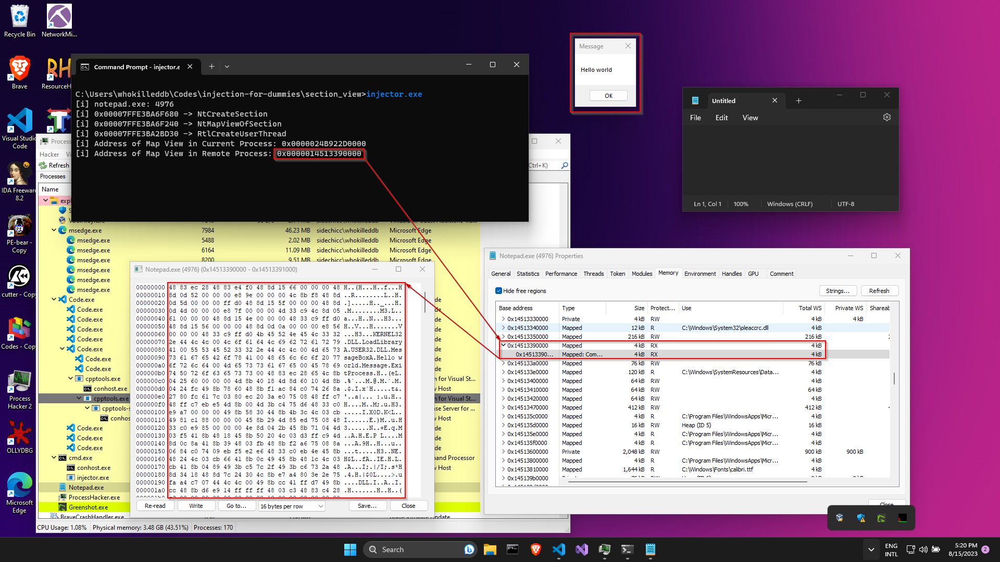

# Section-View Injection

[MSDN](https://learn.microsoft.com/en-us/windows-hardware/drivers/kernel/section-objects-and-views) describes Sections and Views as:

> A section object represents a section of memory that can be shared. A process can use a section object to share parts of its memory address space (memory sections) with other processes. 

> Each memory section has one or more corresponding views. A view of a section is a part of the section that is actually visible to a process. The act of creating a view for a section is known as mapping a view of the section. Each process that is manipulating the contents of a section has its own view; a process can also have multiple views (to the same or different sections).

TLDR: A section is a region of memory that can be shared between two processes. This a process to share a part of it's virtual address space with other processes. To make this memory region available to the processes, we need to create a _"view"_ of the Section. This allows the process to access and manipulate the contents of the section as if it were regular memory. 

Essentially, this allows processes to share memory regions with each other and henceforth, we will see how we can use this mechanism to inject code into a remote process. 

## The Code

Starting off with the `main()` function, we follow the usual convention of finding the PID of the target process and then passing it on as a parameter to the `inject_section_view()` function which contains the injection code.

```c
int main() {
    DWORD pid = find_pid(TARGET);
    int result = inject_section_view(pid);
    return 0;
}
```

The `inject_section_view()` function has the following structure:
```c
// map section views injection
int inject_section_view(DWORD pid) {
	CLIENT_ID cid;
    NTSTATUS status; 
    HANDLE hThread = NULL;
    HANDLE hSection = NULL;
    PVOID pLocalView = NULL; 
    PVOID pRemoteView = NULL;

    // Resolve Functions
    HMODULE hNtdll = GetModuleHandle("NTDLL.DLL");
	NtCreateSection_t pNtCreateSection = (NtCreateSection_t) GetProcAddress(hNtdll, "NtCreateSection");
    NtMapViewOfSection_t pNtMapViewOfSection = (NtMapViewOfSection_t) GetProcAddress(hNtdll, "NtMapViewOfSection");
	RtlCreateUserThread_t pRtlCreateUserThread = (RtlCreateUserThread_t) GetProcAddress(hNtdll, "RtlCreateUserThread");

    // Create and map Section
	status = pNtCreateSection(&hSection, SECTION_ALL_ACCESS, NULL, (PLARGE_INTEGER) &payload_len, PAGE_EXECUTE_READWRITE, SEC_COMMIT, NULL);
    status = pNtMapViewOfSection(hSection, GetCurrentProcess(), &pLocalView, NULL, NULL, NULL, (SIZE_T *)&payload_len, ViewUnmap, NULL, PAGE_READWRITE);
    memcpy(pLocalView, payload, payload_len);
    HANDLE hProcess = OpenProcess(PROCESS_ALL_ACCESS, FALSE, pid);
	status = pNtMapViewOfSection(hSection, hProcess, &pRemoteView, NULL, NULL, NULL, (SIZE_T *) &payload_len, ViewUnmap, NULL, PAGE_EXECUTE_READ);
	
    // Create thread
    status = pRtlCreateUserThread(hProcess, NULL, FALSE, 0, 0, 0, pRemoteView, 0, &hThread, &cid);
	int _result = WaitForSingleObject(hThread, -1);
    CloseHandle(hThread);
    CloseHandle(hSection);
    CloseHandle(hProcess);
    return 0;
}
```

The program can be roughly divided into three parts. We begin with dynamically resolving the addresses of  `NtCreateSection`, `NtMapViewOfSection` and `RtlCreateUserThread` from `NtDLL` using a combination of `GetModuleHandle()` and `GetProcAddress()`.

Next up, we use `NtCreateSection()` to create a section object with the following parameters: 
- `&hSection`: This is a pointer to a HANDLE variable that will receive the handle to the created section object. 
- `SECTION_ALL_ACCESS`: This parameter specifies the desired access rights for the section object. In this case, we want to have all possible access rights to the section including read, write, and execute permissions, among others.
- `NULL`: This parameter represents a pointer to a `SECURITY_DESCRIPTOR` structure, which is used to control security settings for the object. Passing `NULL` indicates that the default security settings should be used.
- `(PLARGE_INTEGER) &payload_len`: This indicates the size of the section object to be created. In this case, we type cast the address of the variable holding the size of the payload(`&payload_len`) to a `PLARGE_INTEGER`.
- `SEC_COMMIT`: This parameter specifies that the memory for the section should be immediately allocated and committed, making it available for use.
- `NULL`: This parameter represents a pointer to a `SEC_IMAGE_INFORMATION` structure. It's used for image files and can be safely set to `NULL` when not applicable.

Once the section object has been created, then we map a view of it to the current process's virtual address space using `NtMapViewOfSection()` with the following parameters:

- `hSection`: This is a handle to the section object we previously created. 

- `GetCurrentProcess()`: This Windows API function returns a handle to the current process, indicating that the section will be mapped into the current process's virtual address space.

- `&pLocalView`: This is a pointer to a pointer that will receive the base address of the view that is created. In other words, it will hold the starting address of the memory region in the current process's virtual address space where the mapped section will reside.

- `NULL`: This parameter is the desired base address of the view in the current process's address space. Passing `NULL` here means that the operating system will choose a suitable base address automatically.

- `NULL`: This parameter is the suggested size of the view in bytes. If `NULL` is passed, the system will automatically set the view size to match the size of the section being mapped.

- `NULL`: This parameter is a pointer to offset within the section to map. If `NULL` is passed, the entire section will be mapped.

- `(SIZE_T *)&payload_len`: This is a pointer to a variable that will receive the size, in bytes, of the section that was mapped. The initial value specifies the view's size, in bytes.

- `ViewUnmap`: This parameter specifies the type of access that will be allowed for the mapped view.`ViewUnmap` indicates that the view should be mapped for read/write access and that it will be unmapped when the process ends.

- `NULL`: Ignore the allocation type.

- `PAGE_READWRITE`: This parameter specifies the protection level of the pages in the view. In this case, the pages are marked as read/write, indicating that the process can both read from and write to the mapped memory.

Now, we should have a view of the section available to the current process with RW permissions, which should allow us to copy over our payload over to the mapped view with:

```c
memcpy(pLocalView, payload, payload_len);
```

Once we have copied over our payload, we open a handle to the Target Process with `OpenProcess()` and again, use `NtMapViewOfSection()` like last time to map a view of the section in the target process's memory. However, there are a couple of important pointers to note:

- Instead of using `GetCurrentProcess()`, we pass in the handle to remote process we acquired using `OpenProcess()` which signifies that the view would be created in the remote process. 
- The `pRemoteView` variable receives the address to the mapped view in the target process's virtual address space, like `pLocalView` did previously.
- The memory permissions are set to `PAGE_EXECUTE_READ` because it contains the payload which must be executed and there is no need to write to the memory region, unlike the first time where we set the permissions to `PAGE_READWRITE` because we needed to copy over our payload. 

Now that the target process has a view of the mapped section in it's virtual address space, we can move onto the next part of the program: Running the payload. 

To run our payload, we use the `RtlCreateUserThread()` function which is a lot like the `CreateRemoteThread()` function we have been using in the other injection techniques. The parameters passed to `RtlCreateUserThread()` are as follows:

- `hProcess`: Handle to the target process we previously acquired using `OpenProcess()`
- `NULL`: This parameter specifies thread attributes for the new thread. Passing `NULL` here indicates that default attributes should be used for the new thread.
- `FALSE`:  This parameter determines whether the new thread should start in a suspended state. A value of `FALSE` means the thread will start executing immediately after creation.
- `0`: This parameter specifies the initial size of the stack for the new thread. A value of `0` indicates that the default stack size will be used.
- `0`: Similar to the previous parameter, this one specifies the maximum stack size for the new thread. Once again, a value of `0` indicates that the default maximum stack size will be used.
- `0`: This parameter represents the initial thread flags. These flags can be used to specify certain attributes or behaviors of the thread. In this case, it's set to `0`, meaning that no specific flags are being set.
- `pRemoteView`: This parameter is the address of the thread function (also known as the entry point) within the target process's address space. The new thread will start executing from this address. In this case, it points to our payload which we want to inject.
- `0`: This parameter is the argument that will be passed to the thread function (entry point) when it starts executing. Since the payload does not need any extra parameters, we can safely set it to `0`.
- `&hThread`: This parameter is a pointer to a variable that will receive the handle to the newly created thread.
- `&cid`: This parameter is a pointer to a variable that will receive the client ID of the newly created thread. 

Once the thread has been created in the Target Process, we use the thread handle(`hThread`) with `WaitForSingleObject()` to wait for the thread to finish execution. Finally, we close all open handles with `CloseHandle()` once execution is finished. 

Compiling and running our code, we should be able to trigger the payload. Using a tool like `Process Hacker`, we can also see the section view mapped into the Target Process's memory with our payload contained in it!


