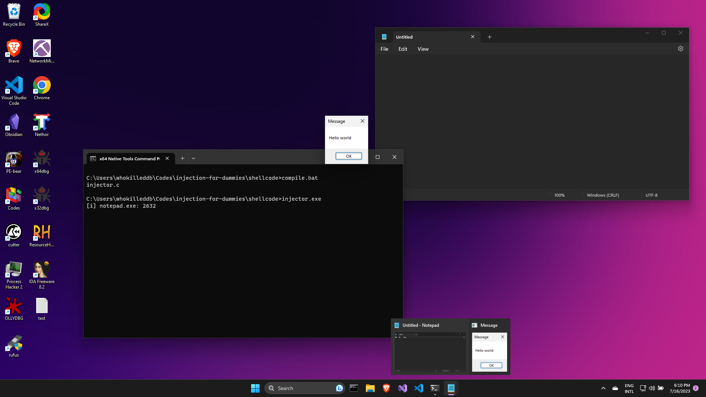

# ShellCode Injection

Shellcode injection is one of the simplest injection technique out there. The idea here is to copy over a shellcode into a remote process's virtual memory and start a thread in the remote process to execute the payload. To better understand this in action, start by looking into the `main()` function for the program:

```c
int main(void) {
    DWORD pid = find_pid(TARGET);
    int result = inject_shellcode(pid);
    return 0;
}
```

The `main()` starts by finding the Process ID (PID) of the target process(`notepad.exe`). Once the PID has been acquired, it passes it to the `inject_shellcode()` which is responsible for the injection, and contains the following code:

```c
int inject_shellcode(DWORD pid) {
    DWORD bWritten = 0;
    HANDLE hProc = OpenProcess(PROCESS_CREATE_THREAD | PROCESS_VM_OPERATION | PROCESS_VM_READ | PROCESS_VM_WRITE, FALSE, pid);
    LPVOID pRemoteCode = VirtualAllocEx(hProc, NULL, payload_len, MEM_COMMIT, PAGE_EXECUTE_READ);
    WriteProcessMemory(hProc, pRemoteCode, (PVOID)payload, (SIZE_T)payload_len, (SIZE_T *)&bWritten);
    HANDLE hThread = CreateRemoteThread(hProc, NULL, 0, pRemoteCode, NULL, 0, NULL);
    WaitForSingleObject(hThread, -1); 
    CloseHandle(hThread);
    CloseHandle(hProc);
    return 0;
}
```

First, we use `OpenProcess()` to get a handle to the process. The parameters passed to the `OpenProcess()` function are as follows:

- The Process access rights: This denotes the permissions for the Handle. The values are explained as:


    | Permission            | Description                                                        |
    | --------------------- | ------------------------------------------------------------------ |
    | PROCESS_CREATE_THREAD | Required to create a thread in the process                         |
    | PROCESS_VM_OPERATION  | Required to perform an operation on the address space of a process |
    | PROCESS_VM_READ       | Required to read memory in a process using                         |
    | PROCESS_VM_WRIT       | Required to write to memory in a process using                     | 

- The `bInheritHandle` flag: This denotes whether we would like any child processes to inherit the handle. Since, we dont really need that, we set it to `FALSE` (but seriously, changing it to `TRUE` does not change the execution behavior, so go nuts!)
- The PID of the target: We specify the PID of the target process which we had previously got from the `find_pid()` function. 

Next up, we allocate memory in the target process's virtual memory by using the `VirtualAllocEx()` function and store the address of the allocated memory region in the `pRemoteCode` variable. The parameters passed to the function, in order, are:
- The handle to the remote process(`hProc`)
- A `NULL` value to indicate that we have no desired starting address 
- Length of payload (`payload_len`) aka the size of memory to be allocated
- Reserve the memory region and commit it at once with `MEM_RESERVE | MEM_COMMIT` to make it available for use.
- Set permissions of the memory region as `PAGE_EXECUTE_READ` to be able to execute our shell code

With the memory allocated, we copy our payload into the process's address space with `WriteProcessMemory()`. We pass the following required parameters to the function:
- The handle to the target process(`hProc`)
- The destination address where the payload must be copied to, aka, the starting address of the allocated memory region (`pRemoteCode`)
- The source address from which data is to be copied, i.e, the address of the buffer containing our shellcode (`paylod_len`)
- The number of bytes to be copied, aka, the size of the payload buffer (`payload_len`), and 
- The address to a variable(`bWritten`) to store the total number of bytes actually written to the buffer.


> One important question to ask here is while using `VirtualAllocEx()` to allocate memory, we did not specify any WRITE permissions, then how can we copy our payload over to the memory location? This has been left as an exercise to the reader. A good place to start would be the [WriteProcessMemory()](https://learn.microsoft.com/en-us/windows/win32/api/memoryapi/nf-memoryapi-writeprocessmemory) documentation.


With the payload now written in the target process's memory, we create a thread to run the payload. We use the `CreateRemoteThread()` for this, to which we pass the following parameters:
- Handle of the target process (`hProc`)
- A `NULL` value to signify that the thread gets a default security descriptor. This also signifies that the handle cannot be inherited by any child processes
- A `0` to signify that we will be using the default stack size
- Set the thread function as the starting address to the payload in the process's virtual address space (`pRemoteCode`)
- A `NULL` to signify that no variables are to be passed to the the thread function
- A `0` to signify to run the thread immediately after creation
- A `NULL` to ignore the thread identifier

If the function runs successfully, a handle to the remote thread (`hThread`) is returned. We can now use `WaitForSingleObject()` to wait till the thread finishes execution.

Compiling and running the program should run our injector code and prompt a `Hello World!` message box running under *Notepad.exe*.
This should inject our shellcode and we should have a Hello World! message running under **Notepad.exe**, indicating that our injection was successful.

